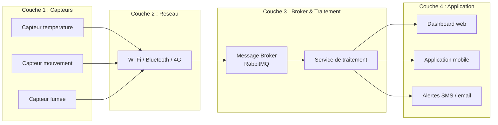
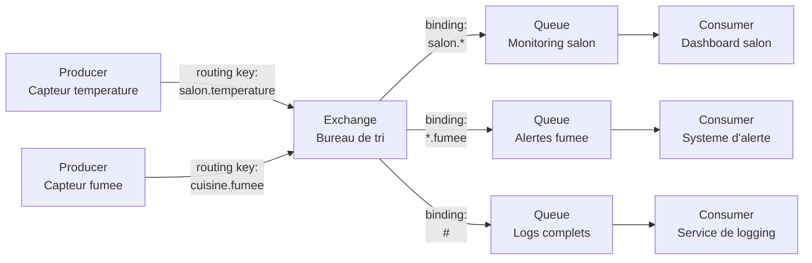
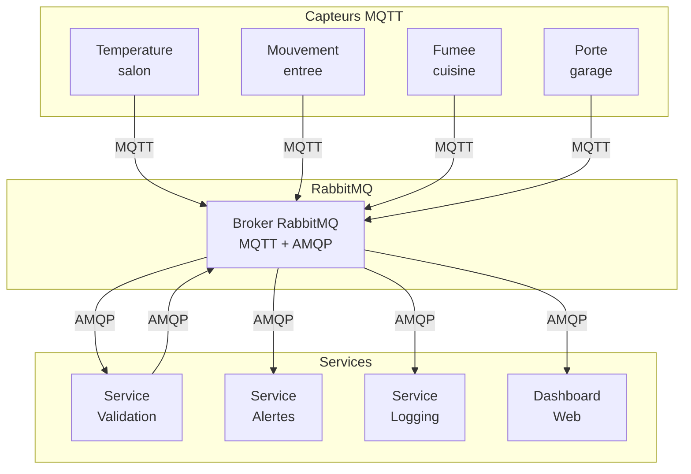

# Session 1 : Introduction a l'IoT et RabbitMQ

> **Duree estimee :** ~1h de lecture/presentation
> **Objectif :** Comprendre ce qu'est l'Internet des Objets, pourquoi les protocoles de messaging sont essentiels, et decouvrir les concepts fondamentaux de RabbitMQ.

---

## Partie 1 -- L'Internet des Objets (25 min)

### 1.1 Qu'est-ce que l'IoT ?

L'**Internet des Objets** (IoT, pour *Internet of Things*) designe l'ensemble des objets physiques connectes a Internet, capables de collecter, d'envoyer et parfois de recevoir des donnees **sans intervention humaine directe**.

Concretement, un objet connecte c'est :

- un **capteur** (ou un actionneur) integre dans un objet du quotidien,
- une **connexion reseau** (Wi-Fi, Bluetooth, 4G, LoRa...),
- un **logiciel** qui traite et transmet les donnees.

> **En resume :** L'IoT, c'est donner a des objets physiques la capacite de "parler" entre eux et avec des applications, via Internet.

### 1.2 Exemples concrets du quotidien

Pour bien comprendre, regardons des objets que vous utilisez peut-etre deja :

| Objet | Ce qu'il mesure / fait | A qui il envoie les donnees |
|---|---|---|
| **Montre connectee** (Apple Watch, Fitbit) | Frequence cardiaque, pas, sommeil | Application sur votre telephone |
| **Thermostat Nest** | Temperature ambiante | Serveurs Google, application mobile |
| **Camera Ring** | Detection de mouvement, video | Cloud Amazon, notification sur telephone |
| **Capteur de qualite de l'air** (Netatmo) | CO2, humidite, temperature | Serveur du fabricant, dashboard web |
| **Ampoule Philips Hue** | -- | Recoit des ordres (allumer, eteindre, couleur) |

Remarquez un point commun : **ces objets ne fonctionnent pas seuls**. Ils ont besoin d'envoyer leurs donnees quelque part pour qu'elles soient utiles. Une montre qui mesure votre pouls mais ne transmet rien... ca ne sert a rien.

### 1.3 Les 4 couches d'un systeme IoT

Tout systeme IoT, qu'il soit simple ou complexe, repose sur **4 couches** empilees les unes sur les autres :

| Couche | Role | Exemple |
|---|---|---|
| **1. Capteurs / Actionneurs** | Collecter des donnees ou agir sur l'environnement | Capteur de temperature, moteur de volet roulant |
| **2. Reseau** | Transporter les donnees du capteur au serveur | Wi-Fi, Bluetooth, 4G, LoRa |
| **3. Broker / Traitement** | Recevoir, trier, router et traiter les messages | RabbitMQ, Mosquitto, serveur applicatif |
| **4. Application / Dashboard** | Presenter les donnees a l'utilisateur et permettre les actions | Application mobile, page web, alerte SMS |

Voici un schema de cette architecture :



> **Point cle :** Le **broker** (couche 3) est le coeur du systeme. C'est lui qui recoit tous les messages des capteurs et les redistribue aux bonnes applications. Sans lui, chaque capteur devrait connaitre chaque application -- un cauchemar a maintenir.

### 1.4 Pourquoi HTTP ne suffit pas pour l'IoT

Si vous avez deja fait du developpement web, vous connaissez HTTP : votre navigateur **envoie une requete** au serveur, le serveur **repond**, et c'est fini. La connexion est fermee.

Ca fonctionne tres bien pour un site web. Mais pour l'IoT, ca pose **4 problemes majeurs** :

#### Probleme 1 : Requete ponctuelle vs connexion maintenue

Avec HTTP, le client doit envoyer une nouvelle requete a chaque fois qu'il veut communiquer. Imaginez un capteur de temperature qui envoie une mesure toutes les 5 secondes : il doit ouvrir une connexion, envoyer sa requete, attendre la reponse, fermer la connexion... **et recommencer 5 secondes plus tard**. C'est du gaspillage.

Avec un protocole de messaging comme MQTT, le capteur **ouvre une seule connexion** et envoie ses messages dessus en continu. Beaucoup plus efficace.

#### Probleme 2 : Scalabilite -- 10 000 capteurs en meme temps

Imaginez un immeuble de bureaux avec 10 000 capteurs (temperature, mouvement, luminosite, CO2, chaque piece ayant plusieurs capteurs). Si chaque capteur fait des requetes HTTP vers un serveur central, ce serveur doit gerer **10 000 connexions simultanees qui s'ouvrent et se ferment en permanence**. Le serveur web classique n'est pas concu pour ca.

Un **message broker** comme RabbitMQ est concu exactement pour ce scenario : gerer des **milliers de connexions persistantes** et **trier des millions de messages** par jour.

#### Probleme 3 : Fiabilite -- le capteur qui se deconnecte

En HTTP, si le serveur est indisponible au moment ou le capteur envoie sa donnee, la donnee est **perdue**. Le capteur ne la renvoie pas automatiquement.

Un message broker offre des mecanismes de **garantie de livraison** : si le destinataire n'est pas disponible, le message est **stocke dans une file d'attente** et sera livre plus tard. Rien n'est perdu.

#### Probleme 4 : Consommation d'energie

Beaucoup d'objets IoT fonctionnent **sur batterie** (capteurs sans fil, serrures connectees...). Ouvrir et fermer des connexions HTTP consomme de l'energie. Les protocoles IoT comme MQTT sont optimises pour **minimiser la consommation** en gardant la connexion ouverte avec un minimum de trafic (un simple "ping" periodique).

> **En resume :** HTTP c'est comme envoyer un courrier recommande a chaque fois que vous voulez dire "il fait 22 degres". Les protocoles IoT c'est comme avoir un telephone toujours en ligne : vous parlez quand vous voulez, sans raccrocher a chaque phrase.

---

## Partie 2 -- Protocoles de communication IoT (10 min)

### 2.1 Les 3 principaux protocoles

Il existe plusieurs protocoles conçus pour l'IoT. Voici les trois plus courants :

| Critere | **MQTT** | **AMQP** | **CoAP** |
|---|---|---|---|
| **Modele** | Publish / Subscribe | Publish / Subscribe + Queuing | Requete / Reponse (comme HTTP) |
| **Poids** | Tres leger (en-tete de 2 octets minimum) | Plus lourd mais tres robuste | Leger |
| **Transport** | TCP | TCP | UDP |
| **Routing** | Simple (topics hierarchiques) | Complexe (exchanges, bindings, routing keys) | Pas de routing integre |
| **Fiabilite** | 3 niveaux de QoS (0, 1, 2) | Acknowledgements, persistance, transactions | Confirmable / Non-confirmable |
| **Cas d'usage principal** | IoT, capteurs, domotique | Systemes d'entreprise, microservices | Objets tres contraints (peu de memoire/CPU) |
| **Exemple concret** | Thermostat qui envoie la temperature | Systeme bancaire, traitement de commandes | Capteur agricole sur pile |

#### MQTT en un mot

**MQTT** (*Message Queuing Telemetry Transport*) a ete cree en 1999 par IBM pour des pipelines petroliers dans le desert -- la ou la connexion reseau est instable et la bande passante limitee. C'est devenu **le standard de fait** pour l'IoT grace a sa simplicite et sa legerete.

#### AMQP en un mot

**AMQP** (*Advanced Message Queuing Protocol*) est un protocole plus riche, concu pour des systemes d'entreprise qui ont besoin de **routing complexe** et de **garanties fortes**. Il est plus lourd mais offre beaucoup plus de flexibilite dans la facon dont les messages sont distribues.

#### CoAP en un mot

**CoAP** (*Constrained Application Protocol*) est concu pour des devices **extremement limites** en memoire et en puissance de calcul. Il fonctionne comme un "mini-HTTP" sur UDP. On le croise surtout dans des reseaux de capteurs industriels.

### 2.2 Ou se positionne RabbitMQ ?

RabbitMQ est un **message broker** -- un intermediaire qui recoit, stocke et redistribue des messages. Son positionnement est unique :

- Il parle **AMQP nativement** : c'est son protocole principal, avec toute la puissance du routing par exchanges et bindings.
- Il parle **MQTT via un plugin** (`rabbitmq_mqtt`) : les objets IoT peuvent publier en MQTT, et RabbitMQ s'occupe de tout convertir en interne.

Autrement dit, RabbitMQ fait le **pont entre le monde IoT (MQTT) et le monde des applications d'entreprise (AMQP)**. C'est exactement ce dont on a besoin pour notre systeme domotique.

```
Capteur IoT ──MQTT──> [ RabbitMQ ] ──AMQP──> Application / Service
```

> **Ce qu'il faut retenir :** MQTT est le protocole que parlent les capteurs. AMQP est le protocole que parlent les applications. RabbitMQ comprend les deux et fait le lien.

---

## Partie 3 -- Introduction a RabbitMQ (25 min)

### 3.1 L'analogie du bureau de poste

Pour comprendre RabbitMQ, imaginons un **bureau de poste** :

| Concept RabbitMQ | Equivalent bureau de poste | Role |
|---|---|---|
| **Producer** | L'expediteur | Celui qui envoie un message (ex : un capteur) |
| **Message** | La lettre | Les donnees transportees (ex : `{"temperature": 22.5}`) |
| **Exchange** | Le bureau de tri | Recoit les lettres et decide dans quelle boite aux lettres les mettre |
| **Routing Key** | L'adresse sur l'enveloppe | Indique au bureau de tri ou envoyer le message |
| **Binding** | La regle de tri | Le lien entre le bureau de tri et une boite aux lettres ("toutes les lettres pour le 75000 vont dans le casier Paris") |
| **Queue** | La boite aux lettres | Stocke les messages en attendant qu'ils soient recuperes |
| **Consumer** | Le destinataire / facteur | Celui qui lit les messages (ex : une application dashboard) |

Reprenons l'analogie de bout en bout :

1. L'**expediteur** (Producer) ecrit une lettre (Message) et inscrit l'adresse (Routing Key) sur l'enveloppe.
2. Il depose la lettre au **bureau de tri** (Exchange).
3. Le bureau de tri regarde l'adresse et applique ses **regles de tri** (Bindings) pour savoir dans quelle **boite aux lettres** (Queue) placer la lettre.
4. Le **destinataire** (Consumer) vient recuperer son courrier dans sa boite.

Simple, non ?

### 3.2 Le flux de messages dans RabbitMQ

Voici le parcours d'un message dans RabbitMQ, represente sous forme de schema :



**Ce qui se passe :**

1. Deux capteurs (producers) envoient des messages avec des **routing keys** differentes.
2. L'**exchange** recoit tous les messages et les distribue selon ses **bindings** (regles).
3. Le message du salon va dans la queue "Monitoring salon" (binding `salon.*`).
4. Le message de fumee va dans la queue "Alertes fumee" (binding `*.fumee`).
5. **Les deux** messages vont dans la queue "Logs complets" (binding `#` = tout recevoir).
6. Chaque **consumer** lit les messages de sa queue.

> **Point important :** Un meme message peut etre copie dans **plusieurs queues** selon les bindings. C'est la force du routing RabbitMQ.

### 3.3 Le vocabulaire essentiel

Avant d'aller plus loin, definissons clairement chaque terme que vous allez rencontrer tout au long de cette formation :

#### Message

Un **message** est l'unite de base de communication. C'est un paquet de donnees envoye par un producer et recu par un consumer. En IoT, un message est souvent au format **JSON** :

```json
{
  "sensor": "temperature",
  "value": 22.5,
  "room": "salon",
  "timestamp": "2026-03-19T10:30:00Z"
}
```

Un message est compose de deux parties :
- Les **proprietes** (metadonnees) : routing key, type de contenu, priorite, etc.
- Le **corps** (*payload*) : les donnees utiles (le JSON ci-dessus).

#### Routing Key

La **routing key** est une chaine de caracteres attachee au message par le producer. Elle sert a indiquer a l'exchange **ou ce message doit aller**.

Exemples de routing keys :
- `salon.temperature`
- `cuisine.fumee`
- `entree.mouvement`

C'est l'equivalent de l'adresse sur l'enveloppe.

#### Binding

Un **binding** est une **regle** qui lie un exchange a une queue. Il dit : "tous les messages dont la routing key correspond a tel pattern doivent aller dans telle queue".

Exemples de bindings :
- `salon.*` : tous les messages du salon, quel que soit le type de capteur
- `*.fumee` : tous les messages de fumee, quelle que soit la piece
- `#` : tous les messages, sans exception

#### Acknowledgement (ack)

Quand un consumer recoit un message, il doit **confirmer** qu'il l'a bien traite. C'est l'**acknowledgement** (ou "ack"). Tant que le consumer n'a pas envoye son ack, RabbitMQ considere que le message n'est pas traite et le **garde dans la queue**.

Cela garantit que si un consumer plante en plein traitement, le message n'est pas perdu : RabbitMQ le re-delivre a un autre consumer (ou au meme consumer quand il redemarrera).

> **En Session 1**, pour simplifier, on utilisera le mode **auto-ack** (l'ack est envoye automatiquement des que le message est recu). On passera au mode **manual-ack** en Session 2 pour plus de fiabilite.

### 3.4 Notre projet fil rouge : le systeme domotique

Tout au long de cette formation (4 sessions), nous allons construire progressivement un **systeme de domotique** -- un systeme de securite et d'automatisation pour une maison connectee.

Voici ce que nous allons batir, etape par etape :

| Session | Ce qu'on construit | Concepts appris |
|---|---|---|
| **Session 1** (aujourd'hui) | Un capteur de temperature qui envoie des mesures, un consumer qui les affiche | Producer, Consumer, Queue, Message |
| **Session 2** | Plusieurs capteurs (temperature, mouvement, fumee) avec du routing intelligent | Exchanges (Direct, Fanout, Topic), Bindings, Securite, Ack |
| **Session 3** | Une architecture microservices : capteurs MQTT, validation, alertes | MQTT, Pipeline, Microservices |
| **Session 4** | Le projet final : systeme de securite complet avec niveaux d'alerte | Tous les concepts combines |

Voici a quoi ressemblera notre systeme final :



**Aujourd'hui**, on commence simple : un seul capteur de temperature, une seule queue, un seul consumer. Mais chaque session ajoutera une brique supplementaire jusqu'au systeme complet.

---

## Recapitulatif de la session

Voici les points cles a retenir avant de passer a la pratique :

1. **L'IoT** c'est connecter des objets physiques a Internet pour collecter et exploiter des donnees.
2. Un systeme IoT a **4 couches** : capteurs, reseau, broker/traitement, application.
3. **HTTP ne suffit pas** pour l'IoT : il faut des protocoles concus pour les connexions persistantes, la scalabilite et la fiabilite.
4. **MQTT** est le protocole standard de l'IoT (leger, efficace). **AMQP** est le protocole des systemes d'entreprise (robuste, routing complexe).
5. **RabbitMQ** est un message broker qui parle AMQP nativement et MQTT via plugin -- il fait le pont entre les deux mondes.
6. Les concepts fondamentaux de RabbitMQ : **Producer** (envoie), **Exchange** (trie), **Queue** (stocke), **Consumer** (recoit).
7. La **routing key** et les **bindings** permettent de diriger les messages vers les bonnes queues.
8. Les **acknowledgements** garantissent qu'aucun message n'est perdu.

> **Prochaine etape :** on passe a la pratique ! Rendez-vous dans le fichier `TP.md` pour installer RabbitMQ et creer votre premier producer/consumer.
