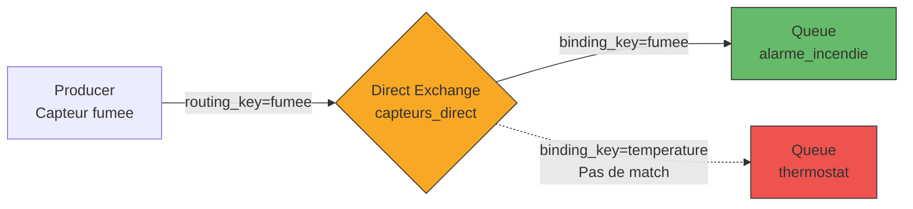
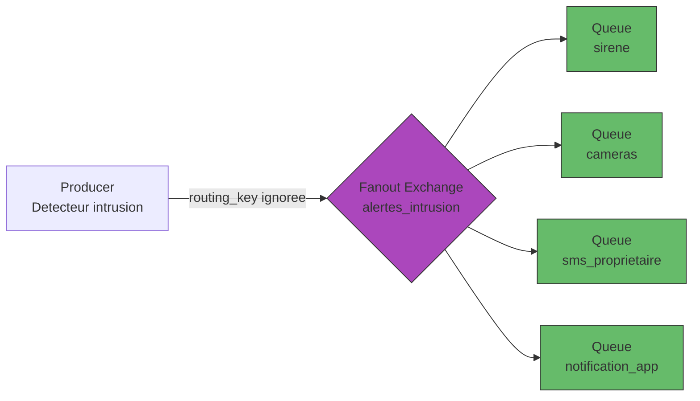
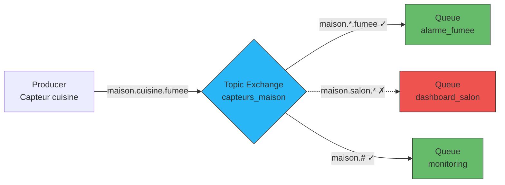
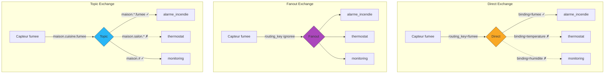
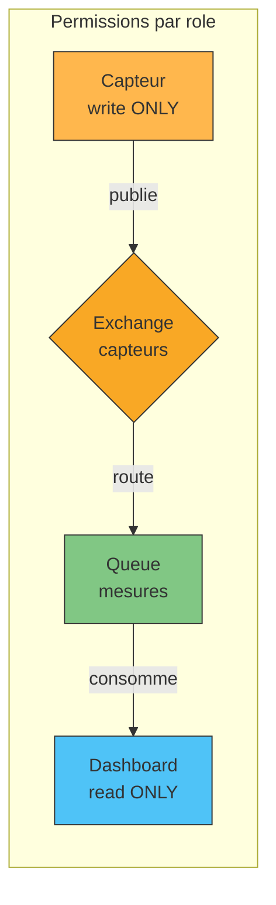
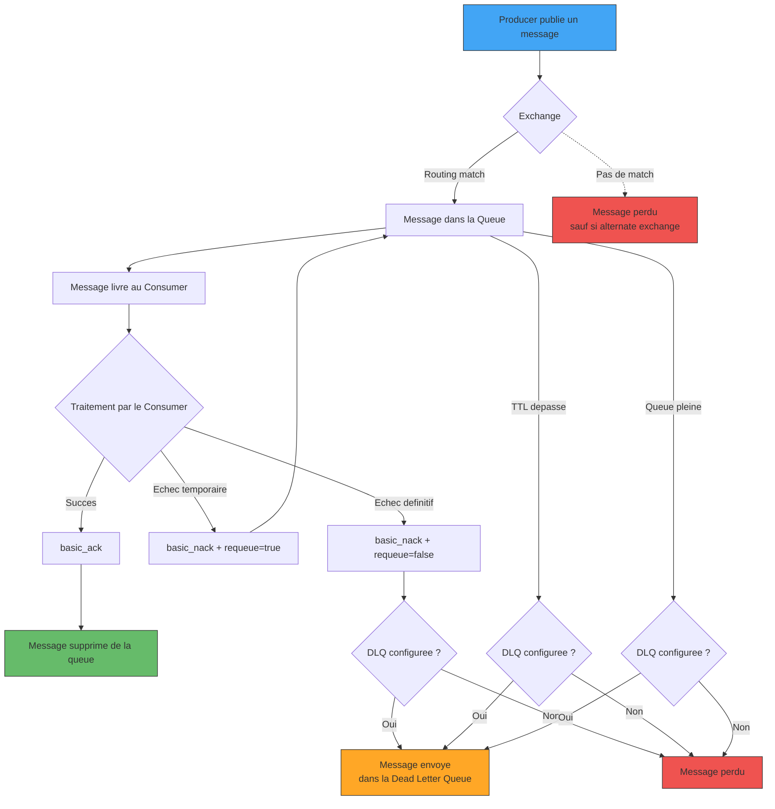

# Session 2 — Exchanges, Securite et Fiabilite des messages

> **Duree estimee : 1h | Prerequis : Session 1 (bases RabbitMQ, producer/consumer simple)**

---

## Introduction

En Session 1, vous avez construit votre premier systeme de messaging : un producer envoie un message, une queue le stocke, un consumer le traite. Simple et efficace.

Mais on utilisait un raccourci : le **default exchange**. Ce mecanisme implicite de RabbitMQ route automatiquement un message vers la queue dont le nom correspond exactement a la routing key. C'est pratique pour debuter, mais dans un vrai systeme domotique, on a besoin de bien plus de flexibilite.

Imaginez votre maison connectee : un capteur de fumee doit alerter **uniquement** l'alarme incendie. Une alerte intrusion doit notifier **tout le monde**. Et un systeme de monitoring doit pouvoir ecouter **certaines pieces** ou **certains types de capteurs** selon des regles souples.

C'est exactement ce que permettent les **exchanges** de RabbitMQ. Dans cette session, on va aussi aborder deux sujets essentiels pour passer d'un prototype a un systeme de production : la **securite** (qui a le droit de faire quoi) et la **fiabilite** (comment s'assurer qu'aucun message ne se perd).

---

## Partie 1 — Les types d'Exchanges (30 min)

### Rappel : le Default Exchange

En Session 1, quand vous faisiez :

```python
channel.basic_publish(exchange='', routing_key='ma_queue', body='Hello')
```

Le parametre `exchange=''` signifie qu'on utilise le **default exchange**. C'est un exchange special, pre-configure dans RabbitMQ, de type **direct**. Sa particularite : chaque queue est automatiquement bindee (liee) a lui avec une routing key egale au nom de la queue.

Autrement dit : si vous publiez un message avec `routing_key='ma_queue'`, il arrive directement dans la queue `ma_queue`. Pas besoin de configurer quoi que ce soit.

C'est parfait pour debuter, mais dans la realite, on veut controler **comment** les messages sont distribues. C'est le role des exchanges.

### Qu'est-ce qu'un Exchange ?

Un exchange est un **aiguilleur**. Il recoit les messages des producers et decide dans quelle(s) queue(s) les envoyer, selon des regles appelees **bindings**.

Le producer ne connait jamais les queues directement. Il envoie ses messages a un exchange avec une **routing key** (une etiquette), et l'exchange fait le tri.

Il existe trois types principaux d'exchanges, chacun avec sa propre logique de routage.

---

### 1.1 — Direct Exchange : le routage exact

#### Principe

Un **Direct Exchange** route un message vers les queues dont le **binding key correspond exactement** a la routing key du message. C'est du routage 1:1 — precis, chirurgical.

#### Analogie domotique

Pensez a un **capteur de fumee** dans votre cuisine. Quand il detecte de la fumee, il envoie un signal avec l'etiquette `fumee`. Ce signal doit aller **uniquement** a l'alarme incendie, pas a la camera du salon ni au thermostat.

Le Direct Exchange fonctionne comme un tableau de correspondance :
- Message avec `routing_key="fumee"` → queue `alarme_incendie` (bindee avec `fumee`)
- Message avec `routing_key="temperature"` → queue `thermostat` (bindee avec `temperature`)

Si aucune queue n'est bindee avec la routing key du message, celui-ci est simplement **ignore** (perdu silencieusement).

#### Exemple de code

```python
# Declaration de l'exchange
channel.exchange_declare(exchange='capteurs_direct', exchange_type='direct')

# Binding : la queue "alarme_incendie" ecoute les messages avec la cle "fumee"
channel.queue_bind(exchange='capteurs_direct', queue='alarme_incendie', routing_key='fumee')

# Le capteur publie un message
channel.basic_publish(
    exchange='capteurs_direct',
    routing_key='fumee',
    body='Fumee detectee dans la cuisine !'
)
```

#### Schema



> Le message avec `routing_key=fumee` est route **uniquement** vers `alarme_incendie`. La queue `thermostat`, bindee avec `temperature`, ne recoit rien.

---

### 1.2 — Fanout Exchange : le broadcast

#### Principe

Un **Fanout Exchange** envoie chaque message a **toutes les queues liees**, sans meme regarder la routing key. C'est du broadcast pur : tout le monde recoit tout.

#### Analogie domotique

Imaginez une **alerte intrusion**. Quand le systeme detecte une intrusion, TOUT le monde doit etre prevenu en meme temps :
- La **sirene** se declenche
- Les **cameras** commencent a enregistrer
- Un **SMS** est envoye au proprietaire
- Une **notification** apparait sur l'app mobile

Peu importe l'etiquette du message : tous les abonnes recoivent l'alerte. C'est exactement le comportement d'un Fanout Exchange.

#### Exemple de code

```python
# Declaration de l'exchange fanout
channel.exchange_declare(exchange='alertes_intrusion', exchange_type='fanout')

# Binding de toutes les queues (pas de routing_key necessaire)
channel.queue_bind(exchange='alertes_intrusion', queue='sirene')
channel.queue_bind(exchange='alertes_intrusion', queue='cameras')
channel.queue_bind(exchange='alertes_intrusion', queue='sms_proprietaire')
channel.queue_bind(exchange='alertes_intrusion', queue='notification_app')

# Le systeme publie une alerte (la routing_key est ignoree)
channel.basic_publish(
    exchange='alertes_intrusion',
    routing_key='',  # ignoree par le fanout
    body='Intrusion detectee ! Zone : entree principale'
)
```

#### Schema



> Les 4 queues recoivent le meme message, simultanement. La routing key n'a aucune importance.

---

### 1.3 — Topic Exchange : le routage par pattern

#### Principe

Un **Topic Exchange** route les messages en comparant la routing key a des **patterns** definis dans les bindings. C'est le plus flexible des trois types.

Les routing keys doivent etre composees de **mots separes par des points**, par exemple : `maison.salon.temperature`.

Les patterns de binding utilisent deux caracteres speciaux :
- `*` (etoile) remplace **exactement un mot**
- `#` (diese) remplace **zero ou plusieurs mots**

#### Analogie domotique

Dans une maison connectee, chaque capteur envoie des messages avec une routing key structuree :

| Capteur | Routing Key |
|---------|-------------|
| Temperature du salon | `maison.salon.temperature` |
| Fumee en cuisine | `maison.cuisine.fumee` |
| Humidite de la salle de bain | `maison.sdb.humidite` |
| Temperature de la cuisine | `maison.cuisine.temperature` |

Maintenant, differents consumers peuvent s'abonner avec des patterns :

| Consumer | Binding Key | Ce qu'il recoit |
|----------|-------------|----------------|
| Alarme incendie | `maison.*.fumee` | Toute la fumee, dans n'importe quelle piece |
| Dashboard salon | `maison.salon.*` | Tout ce qui concerne le salon |
| Monitoring global | `maison.#` | Absolument tout |
| Alerte temperature | `*.*.temperature` | Toutes les temperatures |

#### Exemple de code

```python
# Declaration de l'exchange topic
channel.exchange_declare(exchange='capteurs_maison', exchange_type='topic')

# Bindings avec patterns
channel.queue_bind(exchange='capteurs_maison', queue='alarme_fumee', routing_key='maison.*.fumee')
channel.queue_bind(exchange='capteurs_maison', queue='dashboard_salon', routing_key='maison.salon.*')
channel.queue_bind(exchange='capteurs_maison', queue='monitoring', routing_key='maison.#')

# Le capteur de fumee de la cuisine publie
channel.basic_publish(
    exchange='capteurs_maison',
    routing_key='maison.cuisine.fumee',
    body='Fumee detectee en cuisine !'
)
# → Ce message arrive dans "alarme_fumee" (match maison.*.fumee)
# → Et dans "monitoring" (match maison.#)
# → Mais PAS dans "dashboard_salon" (maison.salon.* ne matche pas maison.cuisine.fumee)
```

#### Schema



---

### 1.4 — Schema comparatif

Voici le meme scenario — un capteur de fumee en cuisine envoie un message — traite par chacun des trois types d'exchanges :



---

### 1.5 — Tableau recapitulatif : quel exchange pour quel besoin ?

| Critere | Direct | Fanout | Topic |
|---------|--------|--------|-------|
| **Routing** | Exact (1 cle = 1 queue) | Broadcast (toutes les queues) | Pattern (wildcards) |
| **Routing key** | Obligatoire et exacte | Ignoree | Structuree avec des `.` |
| **Cas d'usage** | Commande precise a un equipement | Alerte globale a tous les systemes | Filtrage souple par piece/type |
| **Analogie** | Lettre recommandee a une adresse | Annonce au haut-parleur | Abonnement a un journal par rubrique |
| **Performance** | Tres rapide | Tres rapide | Legerement plus lent (matching) |
| **Complexite** | Faible | Tres faible | Moyenne |
| **Exemple IoT** | Capteur fumee → alarme incendie | Intrusion → tout le monde | `maison.*.temperature` → toutes les temperatures |

> **Regle simple :** si un seul destinataire doit recevoir le message → **Direct**. Si tout le monde doit le recevoir → **Fanout**. Si certains destinataires selon des criteres souples → **Topic**.

---

## Partie 2 — Securite et gestion des acces (15 min)

### Pourquoi la securite est critique en IoT

Dans un systeme domotique, chaque objet connecte est un **point d'entree potentiel** sur votre reseau. Un capteur de temperature compromis pourrait :
- Envoyer de fausses donnees pour declencher (ou empecher) des alertes
- Servir de passerelle pour acceder a d'autres equipements
- Saturer le broker avec des messages malveillants (attaque par deni de service)

En entreprise ou en production, le broker RabbitMQ est souvent au **coeur de l'infrastructure**. Si quelqu'un y accede sans autorisation, il peut lire des donnees sensibles, modifier des configurations ou paralyser tout le systeme.

La securite n'est pas une option — c'est une **necessite** des la phase de developpement.

---

### 2.1 — Les utilisateurs RabbitMQ

RabbitMQ possede son propre systeme d'authentification. Chaque connexion doit fournir un **nom d'utilisateur** et un **mot de passe**.

#### Via la CLI (rabbitmqctl)

```bash
# Creer un utilisateur
rabbitmqctl add_user capteur_salon MonMotDePasse123

# Lister les utilisateurs
rabbitmqctl list_users

# Changer le mot de passe
rabbitmqctl change_password capteur_salon NouveauMdp456

# Supprimer un utilisateur
rabbitmqctl delete_user capteur_salon

# Donner le role administrateur (acces au management UI)
rabbitmqctl set_user_tags admin_user administrator
```

#### Via le Management UI

L'interface web de RabbitMQ (accessible par defaut sur `http://localhost:15672`) permet aussi de gerer les utilisateurs de maniere graphique :

1. Onglet **Admin** → **Users**
2. Formulaire pour ajouter un utilisateur
3. Attribution des tags (roles) : `administrator`, `monitoring`, `policymaker`, `management`, ou aucun tag

> **Bonne pratique :** Ne laissez JAMAIS l'utilisateur par defaut `guest` / `guest` actif en production. C'est la premiere chose qu'un attaquant essaiera.

---

### 2.2 — Les Virtual Hosts (vhosts)

#### Concept

Un **Virtual Host** (vhost) est une **isolation logique** a l'interieur de RabbitMQ. Chaque vhost possede ses propres :
- Queues
- Exchanges
- Bindings
- Permissions

C'est comparable a des **bases de donnees separees** dans un serveur SQL, ou a des **appartements dans un immeuble** : chaque locataire a son propre espace, avec ses propres meubles, et ne peut pas acceder a celui du voisin.

#### Pourquoi utiliser des vhosts ?

Imaginons une entreprise qui gere plusieurs batiments connectes :

| Vhost | Usage |
|-------|-------|
| `/batiment-A` | Capteurs et actionneurs du batiment A |
| `/batiment-B` | Capteurs et actionneurs du batiment B |
| `/monitoring` | Systeme de supervision global |
| `/dev` | Environnement de developpement et tests |

Chaque vhost est completement isole. Un capteur du batiment A ne peut pas accidentellement (ou malicieusement) lire les messages du batiment B.

#### Commandes

```bash
# Creer un vhost
rabbitmqctl add_vhost /batiment-A

# Lister les vhosts
rabbitmqctl list_vhosts

# Supprimer un vhost (supprime TOUT son contenu !)
rabbitmqctl delete_vhost /batiment-A
```

---

### 2.3 — Les permissions

#### Les trois types de permissions

RabbitMQ definit trois types d'actions sur les ressources (queues et exchanges) :

| Permission | Action | Exemple |
|------------|--------|---------|
| **configure** | Creer ou supprimer des queues/exchanges | Declarer une nouvelle queue |
| **write** | Publier des messages dans un exchange | Un capteur envoie des donnees |
| **read** | Consommer des messages depuis une queue | Un dashboard lit les mesures |

Chaque permission est definie par une **expression reguliere** (regex) qui s'applique aux noms des ressources.

#### Syntaxe

```bash
rabbitmqctl set_permissions -p /batiment-A capteur_salon "^$" "^capteurs\..*" "^$"
#                            vhost          user         configure  write         read
```

Decodage de cet exemple :
- **configure** = `^$` → ne peut RIEN creer ni supprimer (regex vide)
- **write** = `^capteurs\..*` → peut publier uniquement sur les exchanges dont le nom commence par `capteurs.`
- **read** = `^$` → ne peut RIEN consommer

C'est exactement ce dont un capteur a besoin : **ecrire ses mesures, et rien d'autre**.

#### Le principe du moindre privilege

Ce principe de securite dit : **chaque entite ne doit avoir que les permissions strictement necessaires a son fonctionnement**.

Voici des exemples concrets dans un contexte domotique :

| Entite | configure | write | read | Justification |
|--------|-----------|-------|------|---------------|
| **Capteur temperature** | `^$` | `^capteurs\.temp$` | `^$` | Ecrit ses mesures, c'est tout |
| **Actionneur volet** | `^$` | `^$` | `^commandes\.volets$` | Lit les commandes qu'on lui envoie |
| **Dashboard** | `^$` | `^$` | `^dashboard\..*` | Lit les donnees de monitoring |
| **Application mobile** | `^$` | `^commandes\..*` | `^notifications\..*` | Envoie des commandes, recoit des notifs |
| **Service d'administration** | `.*` | `.*` | `.*` | Acces total (a limiter au maximum !) |



> **Pourquoi c'est important ?** Si un capteur est compromis mais n'a que la permission d'ecriture sur un seul exchange, l'attaquant ne peut ni lire les messages des autres equipements, ni modifier la configuration du broker. Les degats sont **contenus**.

---

## Partie 3 — Fiabilite des messages (15 min)

### Le probleme

Jusqu'ici, on a suppose que tout se passait bien : le producer envoie, le consumer recoit, tout le monde est content. Mais en production, les choses tournent mal :

- Le **consumer plante** en plein traitement d'un message
- **RabbitMQ redemarre** (mise a jour, panne serveur)
- Un message est **impossible a traiter** (donnees corrompues, erreur metier)

Sans mecanismes de fiabilite, ces situations entrainent une **perte silencieuse de messages**. Dans un contexte IoT, cela peut signifier rater une alerte incendie ou perdre des heures de donnees de capteurs.

---

### 3.1 — Les Acknowledgements (ack)

#### Le concept

Un **acknowledgement** (ack) est une confirmation envoyee par le consumer au broker pour dire : "j'ai bien traite ce message, tu peux le supprimer de la queue."

Tant qu'un message n'a pas ete acquitte, RabbitMQ le **garde dans la queue** et peut le re-livrer a un autre consumer si necessaire.

#### Auto Ack vs Manual Ack

Il existe deux modes de fonctionnement :

**Auto Ack (`auto_ack=True`)** — Le message est considere comme traite **des qu'il est envoye** au consumer :

```python
# Auto ack : dangereux en production !
def callback(ch, method, properties, body):
    traiter_message(body)  # Si ca plante ici, le message est PERDU

channel.basic_consume(queue='mesures', on_message_callback=callback, auto_ack=True)
```

**Manual Ack (`auto_ack=False`)** — Le consumer confirme **explicitement** apres traitement :

```python
# Manual ack : recommande en production
def callback(ch, method, properties, body):
    try:
        traiter_message(body)
        ch.basic_ack(delivery_tag=method.delivery_tag)  # Confirmation explicite
    except Exception as e:
        ch.basic_nack(delivery_tag=method.delivery_tag, requeue=True)  # On remet dans la queue

channel.basic_consume(queue='mesures', on_message_callback=callback, auto_ack=False)
```

#### Comparaison

| Critere | Auto Ack | Manual Ack |
|---------|----------|------------|
| **Fiabilite** | Faible (perte possible) | Forte (message conserve jusqu'a confirmation) |
| **Performance** | Plus rapide | Legerement plus lent |
| **Cas d'usage** | Logs non critiques, metriques | Alertes, commandes, donnees importantes |
| **Si le consumer crash** | Message perdu | Message re-livre a un autre consumer |

> **Regle d'or :** en production, utilisez **toujours** le manual ack pour les messages importants. Le leger cout en performance est negligeable face au risque de perte de donnees.

---

### 3.2 — La persistance des messages

#### Le probleme

Meme avec les acks, si **RabbitMQ lui-meme redemarre**, toutes les queues et messages en memoire sont perdus. Pour survivre a un redemarrage, il faut activer la **persistance**.

#### Deux conditions necessaires

La persistance necessite de configurer **a la fois** la queue et les messages :

**1. Queue durable** — La queue survit au redemarrage :

```python
# La queue sera recree automatiquement au redemarrage de RabbitMQ
channel.queue_declare(queue='alertes_critiques', durable=True)
```

**2. Message persistant** — Le message est ecrit sur disque :

```python
channel.basic_publish(
    exchange='capteurs',
    routing_key='fumee',
    body='Alerte fumee !',
    properties=pika.BasicProperties(
        delivery_mode=2  # 2 = message persistant (ecrit sur disque)
    )
)
```

> **Attention :** il faut les DEUX. Une queue durable avec des messages non persistants → les messages sont perdus au redemarrage. Des messages persistants dans une queue non durable → la queue elle-meme disparait au redemarrage, donc les messages aussi.

| Configuration | Queue durable | Message persistant | Survit au restart ? |
|---------------|:---:|:---:|:---:|
| Aucune persistance | Non | Non | Non |
| Queue durable seule | Oui | Non | Non (messages perdus) |
| Message persistant seul | Non | Oui | Non (queue perdue) |
| **Persistance complete** | **Oui** | **Oui** | **Oui** |

---

### 3.3 — Les Dead Letter Queues (DLQ)

#### Le concept

Une **Dead Letter Queue** (DLQ) est une "file poubelle" — une queue speciale ou atterrissent les messages qui n'ont pas pu etre traites normalement. C'est un filet de securite qui empeche les messages problematiques de disparaitre silencieusement.

Pensez a la **Poste** : quand un colis ne peut pas etre livre (adresse incorrecte, destinataire absent apres 3 tentatives), il n'est pas jete. Il est envoye au **centre de colis non distribues**, ou quelqu'un decidera quoi en faire.

#### Quand un message est-il "dead-lettered" ?

Un message est envoye dans la DLQ dans trois situations :

1. **Rejete (nack/reject)** — Le consumer refuse explicitement le message avec `requeue=False`
2. **Expire (TTL)** — Le message a depasse sa duree de vie maximale dans la queue
3. **Queue pleine** — La queue a atteint sa taille maximale (`x-max-length`) et le message le plus ancien est ejecte

#### Configuration

```python
# 1. Declarer la Dead Letter Queue
channel.queue_declare(queue='alertes_dlq', durable=True)

# 2. Declarer la Dead Letter Exchange
channel.exchange_declare(exchange='dlx', exchange_type='fanout')
channel.queue_bind(exchange='dlx', queue='alertes_dlq')

# 3. Declarer la queue principale avec le renvoi vers la DLX
channel.queue_declare(
    queue='alertes',
    durable=True,
    arguments={
        'x-dead-letter-exchange': 'dlx',        # Exchange de destination pour les dead letters
        'x-message-ttl': 60000,                   # TTL de 60 secondes (optionnel)
        'x-max-length': 10000                      # Max 10 000 messages (optionnel)
    }
)
```

#### A quoi sert la DLQ en pratique ?

- **Debugging** : analyser les messages qui echouent systematiquement
- **Retry** : un service peut relire la DLQ et retenter le traitement plus tard
- **Alerting** : si la DLQ se remplit, c'est un signal qu'un consumer a un probleme
- **Audit** : garder une trace de tous les messages non traites

---

### 3.4 — Cycle de vie complet d'un message

Voici le parcours d'un message de sa creation a sa suppression, en tenant compte de tous les mecanismes de fiabilite :



**Lecture du schema :**

1. Le **producer** publie un message vers un exchange
2. L'exchange **route** le message vers la queue appropriee (ou le perd s'il n'y a pas de match)
3. Le message attend dans la queue jusqu'a ce qu'un **consumer** le prenne
4. Le consumer traite le message et envoie un **ack** (succes), un **nack avec requeue** (echec temporaire → on retente), ou un **nack sans requeue** (echec definitif → direction la DLQ)
5. Si le message expire (TTL) ou que la queue deborde, il est aussi envoye dans la DLQ
6. Sans DLQ configuree, les messages en echec sont **perdus definitivement**

---

## Resume de la session

### Ce qu'on a appris

| Concept | Points cles |
|---------|------------|
| **Direct Exchange** | Routage exact par cle — un message, un destinataire precis |
| **Fanout Exchange** | Broadcast a toutes les queues liees — tout le monde recoit tout |
| **Topic Exchange** | Routage par patterns (`*` et `#`) — filtrage souple et puissant |
| **Utilisateurs** | Authentification obligatoire, gestion via CLI ou Management UI |
| **Virtual Hosts** | Isolation logique des ressources entre projets/environnements |
| **Permissions** | configure / write / read — principe du moindre privilege |
| **Acknowledgements** | Manual ack pour la fiabilite, auto ack uniquement pour le non-critique |
| **Persistance** | Queue durable + message persistant (`delivery_mode=2`) = survit au restart |
| **Dead Letter Queue** | Filet de securite pour les messages rejetes, expires ou en surplus |

### Pour aller plus loin

En Session 3 (TP), vous allez mettre tout cela en pratique :
- Creer et tester les trois types d'exchanges avec des capteurs simules
- Configurer des utilisateurs avec des permissions restreintes
- Implementer des acks manuels et des DLQ
- Observer le comportement du systeme quand un consumer plante

---

> **Rappel :** la documentation officielle de RabbitMQ est excellente et disponible sur [https://www.rabbitmq.com/docs](https://www.rabbitmq.com/docs). N'hesitez pas a la consulter pour approfondir les sujets abordes.
