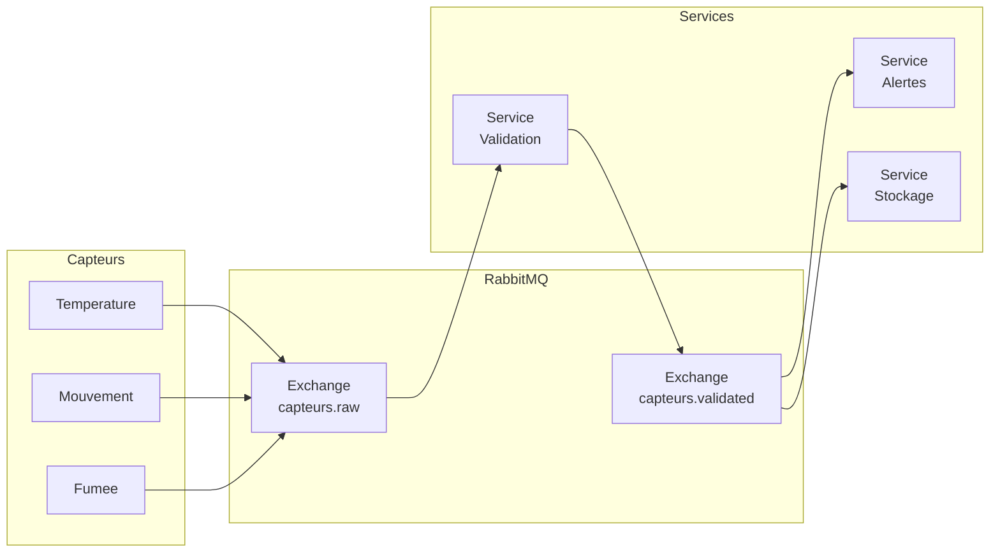
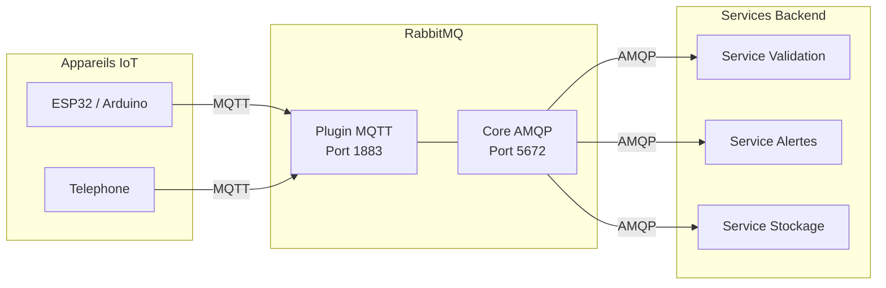
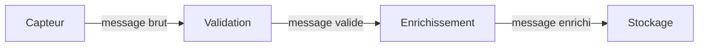
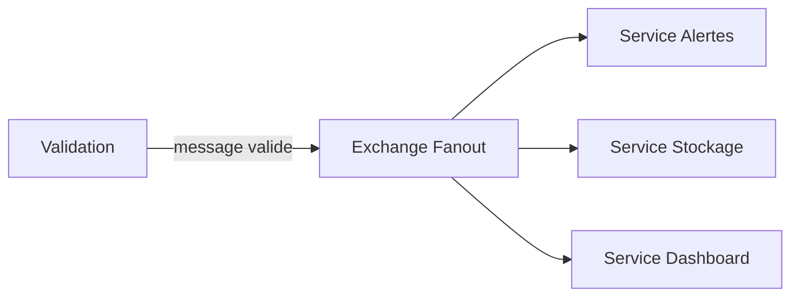

# Session 3 — Integration dans une architecture IoT

> Duree : 1h de theorie | Pre-requis : Sessions 1 et 2 (producer, consumer, exchanges, routing)

---

## Partie 1 — Architecture microservices et IoT (25 min)

### 1.1 Ou en sommes-nous ?

Jusqu'ici, nous avons construit un **producer** (capteur) et des **consumers** (services qui traitent les messages). C'est suffisant pour apprendre les concepts, mais en production, on a besoin de **services specialises** : un pour valider les donnees, un pour les stocker, un pour envoyer des alertes, etc.

La question centrale de cette partie : **comment organiser tous ces services ?**

### 1.2 L'approche monolithique

Un **monolithe**, c'est un seul programme qui fait tout :

- Collecter les donnees des capteurs
- Valider et nettoyer les donnees
- Les stocker en base de donnees
- Envoyer des alertes si un seuil est depasse
- Afficher un tableau de bord

```
┌──────────────────────────────────────────────┐
│              APPLICATION MONOLITHE           │
│                                              │
│  Collecte → Validation → Stockage → Alertes │
│                                              │
│         Tout dans le meme programme          │
└──────────────────────────────────────────────┘
```

**Problemes concrets :**

| Probleme | Explication |
|----------|-------------|
| **Fragilite** | Si le module stockage plante, plus d'alertes non plus — tout tombe en meme temps |
| **Impossible de scaler** | Si les alertes sont lentes, on ne peut pas lancer 3 instances du module alertes seul — il faut dupliquer tout le programme |
| **Deploiement risque** | Une modification du stockage oblige a tout redemarrer, y compris la collecte et les alertes |
| **Complexite croissante** | Plus le programme grossit, plus chaque modification risque de casser autre chose |

### 1.3 L'approche microservices

Avec les **microservices**, chaque responsabilite devient un **service independant** qui fait **une seule chose bien**. Les services ne se connaissent pas directement : ils communiquent uniquement via des **messages**.

**Principes :**

1. **Un service = une responsabilite** : le service Validation ne fait que valider, le service Alertes ne fait qu'alerter
2. **Communication par messages** : les services ne s'appellent jamais directement, ils publient et consomment des messages
3. **Independance** : chaque service peut etre demarre, arrete ou mis a jour sans impacter les autres

### 1.4 RabbitMQ comme bus de communication

RabbitMQ joue le role de **colonne vertebrale** de l'architecture. C'est le point central par lequel transitent tous les messages entre services.



**Lecture du schema :**

1. Les **capteurs** publient des donnees brutes vers RabbitMQ (exchange `capteurs.raw`)
2. Le **service Validation** consomme ces donnees, verifie leur coherence, puis publie les donnees validees vers un second exchange (`capteurs.validated`)
3. Le **service Alertes** et le **service Stockage** consomment independamment les donnees validees

Chaque fleche passe par RabbitMQ. Aucun service ne communique directement avec un autre.

### 1.5 Avantages concrets

| Situation | Monolithe | Microservices |
|-----------|-----------|---------------|
| Le stockage plante | Tout le systeme est HS | Les alertes continuent de fonctionner, les messages s'accumulent dans la queue du stockage |
| Les alertes sont surchargees | Impossible d'agir sur les alertes seules | On lance 2 ou 3 instances du service Alertes (scaling horizontal) |
| Mise a jour du stockage | Il faut arreter et redemarrer tout le programme | On remplace uniquement le service Stockage, les autres ne sont pas impactes |
| Nouveau besoin (dashboard) | Il faut modifier le monolithe et tout redemarrer | On ajoute un nouveau service qui consomme les memes messages |

### 1.6 Analogie : le restaurant

Pour bien comprendre la difference :

**Monolithe = un seul cuisinier qui fait tout**
- Il fait les courses, la cuisine, le service en salle et la vaisselle
- S'il se blesse, le restaurant ferme completement
- Aux heures de pointe, impossible de dedoubler uniquement le service en salle

**Microservices = un restaurant avec une equipe**
- Un chef en cuisine, un commis qui prepare les ingredients, un serveur en salle, un plongeur pour la vaisselle
- Si le plongeur est absent, le restaurant continue de servir (la vaisselle s'accumule, mais les clients mangent)
- Aux heures de pointe, on peut ajouter un second serveur sans toucher a la cuisine

RabbitMQ, dans cette analogie, c'est le **passe-plat** : le chef y depose les assiettes, le serveur vient les chercher. Ils n'ont pas besoin de se parler directement.

---

## Partie 2 — Le protocole MQTT (25 min)

### 2.1 MQTT, le protocole de l'IoT

**MQTT** (Message Queuing Telemetry Transport) est **LE protocole de reference pour l'IoT**. Il a ete cree en **1999 par IBM** pour superviser des pipelines petroliers dans le desert. L'objectif etait simple : un protocole **leger**, capable de fonctionner sur des **connexions instables** avec une **bande passante limitee**.

Aujourd'hui, MQTT est utilise par des milliards d'appareils connectes : capteurs industriels, objets domotiques, voitures connectees, montres intelligentes, etc.

### 2.2 Comparaison MQTT vs AMQP

| Critere | MQTT | AMQP |
|---------|------|------|
| **Cree pour** | Appareils IoT contraints | Systemes d'entreprise |
| **Taille header** | 2 octets minimum | Plusieurs dizaines d'octets |
| **Complexite** | Tres simple (5 types de paquets principaux) | Riche et complet (exchanges, bindings, etc.) |
| **Modele** | Pub/Sub uniquement | Pub/Sub, Point-a-point, Request/Reply |
| **Qualite de service** | 3 niveaux (QoS 0, 1, 2) | Ack/Nack, persistance |
| **Separateur de topics** | `/` (slash) | `.` (point) |
| **Cas d'usage** | Capteurs, embarque, mobile | Backend, microservices, file d'attente |
| **Port par defaut** | 1883 | 5672 |

**En resume** : MQTT est **leger et simple**, ideal pour des appareils avec peu de ressources. AMQP est **puissant et flexible**, ideal pour des serveurs. Les deux sont complementaires.

### 2.3 Les topics MQTT

En MQTT, les messages sont publies sur des **topics** organises de maniere **hierarchique** avec le separateur `/` :

```
maison/salon/temperature
maison/salon/humidite
maison/garage/mouvement
jardin/arrosage/etat
```

**Wildcards (pour les abonnements uniquement) :**

| Wildcard | Signification | Exemple | Matche |
|----------|---------------|---------|--------|
| `+` | Exactement un niveau | `maison/+/temperature` | `maison/salon/temperature`, `maison/garage/temperature` |
| `#` | Zero ou plusieurs niveaux (fin de topic uniquement) | `maison/#` | `maison/salon/temperature`, `maison/garage/mouvement`, etc. |

> **Attention** : en MQTT c'est `+` et `#` avec des `/`, tandis qu'en AMQP c'est `*` et `#` avec des `.`. Ne pas confondre !

### 2.4 Les niveaux de QoS

MQTT propose **trois niveaux de qualite de service (QoS)** pour chaque message :

**QoS 0 — At most once (au plus une fois)**
- Le message est envoye une seule fois, sans confirmation
- Aucune garantie de livraison : si le reseau coupe, le message est perdu
- Utilite : donnees non critiques envoyees frequemment (temperature toutes les secondes)

```
Capteur ──── message ────➤ Broker
         (pas de reponse)
```

**QoS 1 — At least once (au moins une fois)**
- Le broker confirme la reception avec un **ACK**
- Si le capteur ne recoit pas l'ACK, il renvoie le message → possibilite de **doublons**
- Utilite : donnees importantes ou le doublon est acceptable (alerte fumee)

```
Capteur ──── message ────➤ Broker
Capteur ◄──── ACK ─────── Broker
```

**QoS 2 — Exactly once (exactement une fois)**
- Handshake complet en **4 etapes** pour garantir qu'il n'y a ni perte ni doublon
- Plus lent et plus couteux en bande passante
- Utilite : operations critiques ou le doublon serait problematique (commande d'achat, ouverture de porte)

```
Capteur ──── PUBLISH ────➤ Broker
Capteur ◄──── PUBREC ───── Broker
Capteur ──── PUBREL ────➤ Broker
Capteur ◄──── PUBCOMP ──── Broker
```

### 2.5 Retained messages (messages retenus)

Quand un capteur publie avec le flag **retained**, le broker **garde en memoire le dernier message** sur ce topic. Tout nouvel abonne recoit immediatement cette derniere valeur, sans attendre la prochaine publication.

**Exemple concret :**
- Un capteur de temperature publie `22.5°C` sur `maison/salon/temperature` avec `retained = true`
- 10 minutes plus tard, un nouveau service s'abonne a ce topic
- Il recoit immediatement `22.5°C`, sans attendre la prochaine mesure du capteur

C'est particulierement utile pour connaitre l'**etat actuel** d'un capteur des qu'on se connecte.

### 2.6 Last Will and Testament (LWT)

Le **LWT** (testament) est un message configure a la connexion d'un client. Le broker le **publie automatiquement** si le client se deconnecte **brutalement** (perte de connexion, crash, etc.).

**Exemple concret :**
- Un capteur se connecte et declare comme LWT : topic `maison/salon/etat`, message `offline`
- Tant que le capteur est connecte, il publie regulierement des donnees
- Si le capteur perd la connexion (batterie vide, panne reseau), le broker publie automatiquement `offline` sur `maison/salon/etat`
- Le service de monitoring detecte immediatement que le capteur est hors ligne

En combinant LWT et retained messages, on peut toujours connaitre le **statut de chaque capteur** (online/offline).

### 2.7 RabbitMQ comme broker MQTT

RabbitMQ n'est pas qu'un broker AMQP. Grace au plugin **`rabbitmq_mqtt`**, il peut aussi servir de broker MQTT. Cela permet de creer une **passerelle transparente** entre les deux protocoles :



**Fonctionnement :**
1. Un appareil IoT (ESP32, Arduino, telephone) **publie en MQTT** sur le port 1883
2. RabbitMQ recoit le message via le plugin MQTT
3. Le message est rendu disponible cote AMQP
4. Les services backend **consomment en AMQP** sur le port 5672

### 2.8 Conversion automatique des topics

> **Point important a retenir**

RabbitMQ convertit automatiquement les **separateurs de topics** entre MQTT et AMQP :

| MQTT (publication) | AMQP (consommation) |
|--------------------|---------------------|
| `maison/salon/temperature` | `maison.salon.temperature` |
| `maison/garage/mouvement` | `maison.garage.mouvement` |
| `jardin/arrosage/etat` | `jardin.arrosage.etat` |

**Les `/` (MQTT) deviennent des `.` (AMQP) automatiquement.**

Cela signifie qu'un consumer AMQP qui s'abonne avec la routing key `maison.*.temperature` recevra les messages publies en MQTT sur `maison/salon/temperature` et `maison/garage/temperature`.

Concretement, les capteurs parlent MQTT, les services parlent AMQP, et RabbitMQ fait la traduction. Personne n'a besoin de connaitre le protocole de l'autre.

---

## Partie 3 — Patterns de traitement temps reel (10 min)

### 3.1 Pattern Pipeline

Dans un **pipeline**, un message passe de service en service **sequentiellement**. Chaque etape traite le message, puis publie le resultat pour l'etape suivante.



**Exemple dans notre systeme domotique :**

1. Le **capteur** publie `{ "type": "temperature", "value": 23.5 }`
2. Le service **Validation** verifie que la valeur est coherente (entre -20 et 60°C), puis publie le message valide
3. Le service **Enrichissement** ajoute des metadonnees (horodatage, nom de la piece), puis publie le message enrichi
4. Le service **Stockage** sauvegarde le message final en base de donnees

Chaque service n'a qu'une seule responsabilite. Si on veut changer la logique de validation, on modifie uniquement le service Validation.

### 3.2 Pattern Fan-out

Dans un **fan-out**, un message declenche **plusieurs traitements en parallele**. Un seul message valide peut aller simultanement vers plusieurs services.



**Exemple concret :**
- Le service Validation publie un message valide sur un exchange de type **fanout**
- Le message est livre simultanement au service **Alertes** (qui verifie les seuils), au service **Stockage** (qui l'enregistre), et au service **Dashboard** (qui met a jour l'affichage)
- Chaque service travaille independamment des autres

On retrouve ici l'exchange **fanout** vu en Session 2, applique a un cas reel.

### 3.3 Throttling / Prefetch

Quand un service est plus **lent** que les autres (par exemple, le stockage en base de donnees), les messages peuvent s'accumuler et le submerger. Le **prefetch** permet de controler le flux.

**`basic_qos(prefetch_count=N)`** indique a RabbitMQ : "ne m'envoie que **N messages a la fois**, attends que je les acquitte avant de m'en envoyer d'autres."

```python
# Le consumer ne recevra que 5 messages a la fois
channel.basic_qos(prefetch_count=5)
```

```javascript
// Equivalent en Node.js
channel.prefetch(5);
```

**Sans prefetch :**
- RabbitMQ envoie tous les messages d'un coup au consumer
- Si le consumer est lent, il accumule des messages en memoire et risque de planter

**Avec prefetch = 5 :**
- RabbitMQ envoie 5 messages
- Il attend que le consumer en acquitte au moins un avant d'en envoyer un nouveau
- Le consumer traite a son rythme, sans etre submerge

**Combinaison avec le scaling :** si un seul consumer avec `prefetch=5` ne suffit pas, on peut lancer **plusieurs instances** du meme service. RabbitMQ repartit automatiquement les messages entre eux (round-robin), ce qui multiplie la capacite de traitement.

---

## Resume de la session

| Concept | A retenir |
|---------|-----------|
| **Monolithe** | Un seul programme qui fait tout — simple mais fragile et difficile a scaler |
| **Microservices** | Un service par responsabilite, communication par messages — resilient et scalable |
| **RabbitMQ** | Colonne vertebrale de l'architecture, decouple les services entre eux |
| **MQTT** | Protocole leger pour l'IoT, topics avec `/`, 3 niveaux de QoS |
| **Retained messages** | Le broker garde le dernier message pour les nouveaux abonnes |
| **LWT** | Message publie automatiquement quand un client se deconnecte brutalement |
| **Plugin rabbitmq_mqtt** | RabbitMQ fait passerelle MQTT ↔ AMQP, conversion `/` en `.` automatique |
| **Pipeline** | Traitement sequentiel : chaque service passe le relais au suivant |
| **Fan-out** | Un message, plusieurs traitements en parallele |
| **Prefetch** | Limiter le nombre de messages traites simultanement pour eviter la surcharge |
